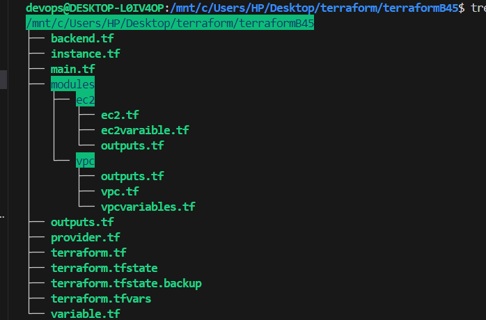

### BLOCKS in Terraform
1. **Terraform Block:**
- It is used to define the global configure
- setting sepcific version
- configuring backend for storing the state file
- defining expeimental or optional features 

```hcl
terraform{ 
    required_providers{ ### indicates the providers used in your configuration
        aws{
            source = "hashicrop/aws ## specifies provider namespace
            version = ">= 2.7.0" ## specifies  provider version
        }
    }
}
```
2. **Provider Block:**
- used to configure and define the provider for specific cloud or information.
- In provider block we specify details such as provider name ane version
- their are two ways to define the provider block
1. direct adding the access and sceret key in provider block 

```hcl
provider "aws" {
  region = "us-west-2"
  access_key = " access-key"
  sceret_key = " sceret-key"
}
```
2. adding the keys  inside the profile with aws configure --profile profile_name. for security in terminal 
```hcl
provider "aws" {
  region = "us-west-2"
  profile = "profile_name"
}
```
3. **Resource Block:**
- The resource block is used to define the infrastructure components (like EC2 instances, storage, etc.) that you want to create and manage.

```hcl
resource "aws_instance" "example" { ## example is the  logical name or identifier using inside the terraform
  ami           = "ami-0c55b159cbfafe1f0"
  instance_type = "t2.micro"
}
```

4. **Variable Block:**
The variable block is used to define input variables for your Terraform configuration, allowing for parameterization and reuse.
- Instead of hardcoding values, you can define variables 

```hcl
variable "instance_type" {
  description = "Type of EC2 instance"
  type= string
  default     = "t2.micro"
}
```
5. **Output Block:**
- The output block defines the values that Terraform will display to the user after applying the configuration, useful for debugging or passing data.

```hcl
output "instance_id" {
  value = aws_instance.example.id
}
```
6. **Module Block:**
- The module block allows you to organize and reuse Terraform configurations by calling modules, which can be locally or from the Terraform Registry.

```hcl
module "vpc" {
  source = "terraform-aws-modules/vpc/aws"
  name   = "my-vpc"
  cidr   = "10.0.0.0/16"
}
```
#### workflow for creating module:


7. **Data Block:**
- The data block is used to retrieve data from a provider that is read-only, such as fetching an existing resource's state (e.g., retrieving an existing AMI).

```hcl
data "aws_ami" "latest_amazon_linux" {
  most_recent = true
  owners      = ["amazon"]
  filters = {
    name = "amzn2-ami-hvm-*-x86_64-gp2"
  }
}
```
8. **Local Block:**
- The locals block allows you to define local values in your Terraform configuration that can be used within the configuration for expressions or to simplify repeated log.

```hcl
locals {
  instance_name = "example-instance"
}
```
9. **Backend Block:**
-The backend block in Terraform is used within the terraform block to configure where and how Terraform stores its state file. 

```hcl
terraform {
backend "s3" {
bucket = "mybucket" ## name of bucket created 
key = "path/to/my/key" ### name of file and the path where u want to create within s3 bucket
region = "us-east-1"
}
}
```
10. **Provisioner Block:**
- The provisioner block in Terraform is a way to run tasks or scripts after a resource is created or updated.
- It’s like giving Terraform extra instructions to set things up, such as installing software, copying files, or running commands to configure the resource.
```hcl
resource "aws_instance" "example" {
  ami           = "ami-123456"
  instance_type = "t2.micro"

  provisioner "remote-exec" {
    inline = [
      "sudo apt-get update",
      "sudo apt-get install -y nginx",
    ]
  }
}
```
### Key Types of Provisioners:
1.local-exec:
- Executes commands on the machine where Terraform is running.
- Example:
```hcl
provisioner "local-exec" {
  command = "echo 'Hello from Terraform!'"
}
```
2. remote-exec:
- Runs commands on the remote resource (e.g., a virtual machine) via SSH or WinRM.
- Example:
```hcl
provisioner "remote-exec" {
  inline = [
    "sudo apt-get update",
    "sudo apt-get install -y nginx",
  ]
}
```
3. file:
 - Copies files or directories to the remote resource.
 - Example
```hcl
provisioner "file" {
  source      = "my-config.sh"
  destination = "/tmp/my-config.sh"
}
```
#### Difference between provisioner block and user data 


- suppose i want to create the backend block and bucket resource block at a single time:
- **ans:** it is not possible because the backend block is create at the **terraform init** because it comes under the terraform block 
and the bucket is creyed after we plan and apply the code through **terraform plan and terraform apply**


